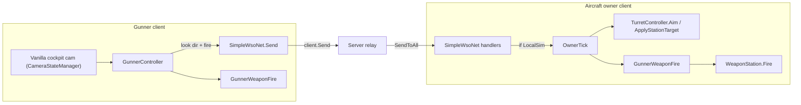

# SimpleWSO

A BepInEx mod for **Nuclear Option** that lets a second player take co-control of an
aircraft's weapon stations while the pilot keeps flying. Built for BepInEx 5 (Mono) +
Harmony, networking over the game's Mirage stack.

> Status: **v1.0** — ready for two-client network testing. Spectate → possess gunner seat,
> vanilla cockpit camera/HUD, weapon cycling, aim/fire relay, and target sharing are in place.

## Approach (vanilla-first)

The game already provides the gunner experience in the cockpit: freelook, zoom, and turret
mouse-tracking. So this mod does NOT build a custom camera. Instead:

- **View:** the gunner is dropped into the game's own cockpit camera for the chosen aircraft
  via `CameraStateManager.SetFollowingUnit(aircraft)` + `SwitchState(cockpitState)`.
- **Aim:** the gunner's look direction is the vanilla camera forward
  (`CameraStateManager.i.mainCamera.transform.forward`).
- **Split:** flight stays with the pilot/host (aircraft owner); only weapon aim + fire are
  handed to the gunner. On the owner, the relayed gunner look overrides the turret vector so
  the turret follows the gunner, not the pilot.

Input is read through **Rewired** (`ReInput.controllers.Keyboard`/`Mouse`), because Nuclear
Option's legacy `UnityEngine.Input` is inert in this build.

## What works / what to test first

1. **Mod alive + input.** On load, look for `SimpleWSO 1.0.0 loaded.` Enable
   `VerboseLogging` in config for the one-time `[Heartbeat]` line and extra diagnostics.
2. **Spectate → possess.** Follow a friendly aircraft in spectator/orbit view, then press **H**
   (`ToggleGunnerKey`) to take a gunner seat. Press **H** again to leave. Vanilla weapon cycle
   and fire apply in the seat.
3. **Solo fallback.** With no followed aircraft, **H** falls back to your own aircraft only
   when you are **not** actively piloting (`IsLocalPlayerPiloting` guard).
4. **Multiplayer co-control.** Same spectate → possess flow on a teammate's aircraft; aim and
   fire relay to the owner. Use the network test checklist below.

## Controls (rebindable in `BepInEx/config/nuclearoption.simplewso.cfg`)

| Key | Config entry | Action |
| --- | --- | --- |
| H | `ToggleGunnerKey` | Possess gunner seat on followed aircraft / leave |
| U | `ShareTargetsKey` | Share targets with the other seat |
| K | `CycleCameraPositionKey` | Cycle configured gunner camera positions |

**Vanilla Rewired actions (not in mod config):** while in gunner mode, weapon stations cycle via
the game's **Next Weapon** and **Previous Weapon** bindings. Fire uses the vanilla **Fire**
action.

Behaviour (`ReplaceSharedTargets`, `VerboseLogging`) and per-aircraft camera adjustments live in
the same config file under `Behaviour` and `CameraOffsets`.

**Camera offsets:** every entry under `CameraOffsets` is a full gunner camera position in
aircraft-local meters from origin (`0,0,0`). Position 1 uses the main key (e.g. `CI-22_Cricket`);
extra positions use `.Position2`, `.Position3`, etc. Cycle with `K`. Defaults are written into
the config file on first run.

## Build

Requires the .NET SDK (tested with 10.x; it builds the `net472` target).

```bash
dotnet build src/SimpleWSO.csproj -c Release
```

The build auto-deploys `SimpleWSO.dll` to
`<game>/BepInEx/plugins/SimpleWSO/`. Override the game location if needed:

```bash
dotnet build src/SimpleWSO.csproj -c Release /p:GamePath="D:\Steam\steamapps\common\Nuclear Option"
```

Disable auto-deploy with `/p:DeployToGame=false`.

The default game path lives in [Directory.Build.props](Directory.Build.props).

## Architecture



- **Authority model.** Units are owner-simulated (`Unit.LocalSim`). Only the owner client
  drives the real turret. A gunner on another machine sends intent; the owner applies it.
- **Transport.** Custom Mirage messages (`GunnerJoin/Leave`, reliable gunner control frames,
  `TargetShare`). Serializers are registered by hand via `Writer<T>.Write` / `Reader<T>.Read`
  because the mod is built without the Mirage weaver. Flow is `gunner -> server -> SendToAll ->
  owner applies`. Handler registration is once per process; scene unload clears owner state only
  (no duplicate relays on mission re-entry).
- **Fire authorization.** `GunnerWeaponFire` is the sole authorized fire path while a station is
  gunner-controlled. `GunnerWeaponFirePatch` blocks vanilla `WeaponStation.Fire` on those
  stations to prevent double-fire from the game's weapon manager.
- **Isolated targets.** `GunnerTargetListPatch` keeps the gunner's target list separate from
  the pilot's `WeaponManager` list while in gunner mode.

## Testing

See **[TESTING_CHECKLIST.md](TESTING_CHECKLIST.md)** for solo smoke, functional, and two-client pass/fail steps.

## Architecture

```
src/
  Plugin.cs                    entry point, hotkeys, update loops
  Core/
    SimpleWsoConfig.cs         keys, behaviour, camera offsets
    GunnerState.cs             local gunner session state
    TargetListUtil.cs          shared target-list helpers
    StationDiscovery.cs        find aircraft + weapon stations
    RewiredInput.cs            input via Rewired (legacy Input is inert)
    Reflect.cs                 cached private-member access
  Gunner/
    GunnerController.cs        session: take/leave/cycle, route aim/fire
    TurretController.cs        drive turrets (aim, station targets)
    GunnerWeaponFire.cs        authorized fire + salvo while gunner-controlled
    VanillaGunnerView.cs       vanilla cockpit camera + HUD handoff
  Net/
    SimpleWsoMessages.cs       wire structs
    SimpleWsoNet.cs            Mirage transport + owner-side apply
  Patches/
    CameraFollowCheckPatch.cs  allow cockpit follow for gunner aircraft
    GunnerCameraOffsetPatch.cs per-airframe gunner camera offsets
    GunnerTargetListPatch.cs   isolated gunner target list
    GunnerWeaponFirePatch.cs   block duplicate vanilla fire on gunner stations
```
